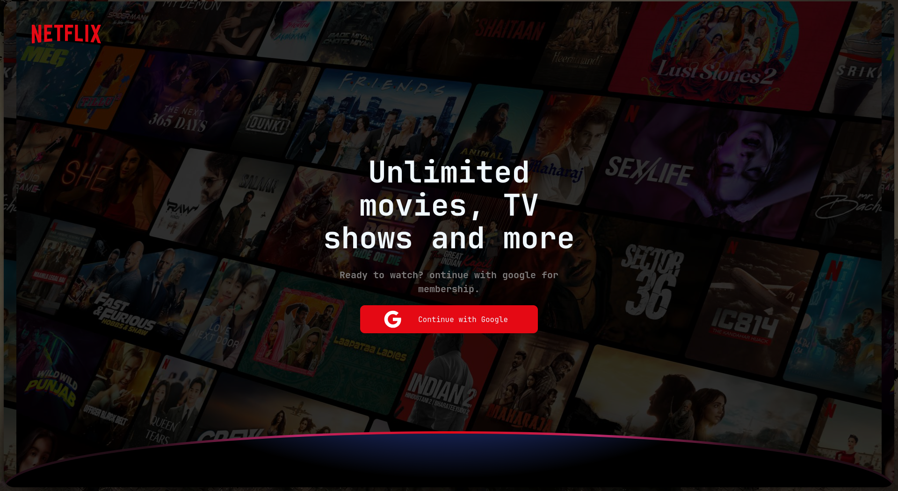

# Netflix Clone

A simple Netflix UI clone built with React + Vite, using Firebase for auth/data.



## Tech Stack

React 18 · Vite · React Router · Firebase

## Run Locally

```bash
git clone https://github.com/Jahanad-pr/Netflix_.git
cd Netflix_
npm install
npm run dev
```

Open the local URL Vite prints (usually `http://localhost:5173`).

> Uses Firebase — add your own Firebase config in `src/` before running if it's not already set up.

## Scripts

- `npm run dev` – start dev server
- `npm run build` – build for production
- `npm run preview` – preview production build

## Deploy

Easiest option: **Vercel**
1. Import the repo at [vercel.com](https://vercel.com/new)
2. It auto-detects Vite (build: `npm run build`, output: `dist`)
3. Deploy

(Netlify works the same way.)
